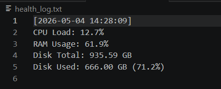

Markdown
# 🖥️ System Health Monitor

This script was developed as a practical automation tool for **Module 1: Technical Support Fundamentals** (Google IT Support Professional Certificate).

## Objective
To automate system health checks by monitoring core hardware metrics. This tool helps IT Support specialists identify performance bottlenecks and log system status for troubleshooting.

## Preview
Here is an example of the generated health report:



## Features
* **CPU Monitoring**: Tracks real-time processor utilization percentage.
* **Memory Analysis**: Monitors RAM usage to ensure system stability.
* **Disk Space Tracking**: Reports total and used disk capacity in a human-readable GB format.
* **Automated Logging**: Saves all diagnostics with precise timestamps into a `health_log.txt` file.
* **Alert System**: Includes logic to flag high resource consumption (e.g., CPU load > 80%).

## Built With (Tools & Technologies)
* **Python 3.x**: The core language for system automation.
* **psutil**: A cross-platform library used to retrieve hardware statistics (CPU, memory, disks).
* **Datetime Module**: Used for precise logging of diagnostic events.

## How to Run
1. Install the required dependency:
   ```bash
   pip install -r requirements.txt
2. Run the diagnostic script:
    ```bash
    python system_monitor.py
3. Open the generated hardware_report.txt file to view your system details.