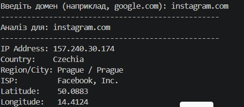

# 🌍 IP Geolocation & DNS Tool

This project is part of **Module 2: Computer Networking**. It demonstrates the connection between human-readable domain names and physical server locations.

---

## 📸 Project Preview

---

## 🎯 Objective
To understand the **Domain Name System (DNS)** process and how IP addresses are routed to specific geographical locations.

## ✨ Features
* **DNS Resolution:** Converts hostnames into IPv4 addresses using Python's `socket` library.
* **Geolocation Integration:** Connects to an external REST API to fetch data about the server's country, city, and ISP.
* **Network Mapping:** Provides coordinates (Latitude/Longitude) for the target infrastructure.

## 🧰 Tech Stack
* **Python 3.x**
* **Requests Library:** For API interaction.
* **Socket Module:** For DNS lookup.

## 📂 How to Use
1. Install dependencies: `pip install -r requirements.txt`
2. Run the script: `python ip_tool.py`
3. Enter any domain (e.g., `github.com`) to see where its servers are located.

---
*Part of the Google IT Support Professional track.*