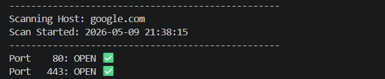

# 📡 TCP Port Scanner

This project was developed as part of **Module 2: The Bits and Bytes of Computer Networking** (Google IT Support Professional Certificate).

## 🎯 Objective
To demonstrate a practical understanding of the **TCP/IP model**, specifically the Transport Layer, by auditing open ports on a target host using the "Three-Way Handshake" logic.

---

## 📸 Project Preview

---

## ✨ Features
* **Network Auditing:** Identifies active services (HTTP, SSH, FTP, etc.) by scanning common ports.
* **Socket Programming:** Implements low-level IPv4 and TCP communication using the `socket` library.
* **Graceful Handling:** Manages connection timeouts and DNS resolution errors to prevent crashes.
* **Timestamped Reports:** Generates a clear console output with the exact time of the audit.

## 🧰 Tech Stack
* **Python 3.x**
* **Socket Library:** Core networking interface.
* **Datetime:** For precise session logging.

## 📂 How to Use
1. Clone the repository.
2. Navigate to the project folder: `cd Google-IT-Support-Professional/Module-2-Computer-Networking/TCP-Port-Scanner`
3. Run the script: `python port_scanner.py`
4. *(Optional)* Modify the `TARGET` variable in `port_scanner.py` to scan a different host or IP.

---
*Part of the Google IT Support Professional track.*