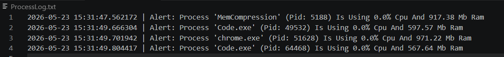

# 🖥️ ServerMonitorProject

A comprehensive automation and monitoring script designed as a practical hands-on project for **Module 3: Operating Systems** within the **Google IT Support Professional Certificate** course.

## 📝 Project Overview
This project serves as an essential automation tool for system administrators. It focuses on low-level operating system resource monitoring, specifically tracking CPU and RAM utilization for all active processes. By implementing dynamic threshold detection and automated logging, this tool helps administrators maintain system health and prevent resource exhaustion.



## ✨ Core Features
1. **Real-Time Resource Tracking:** Captures live metric percentages for CPU and Memory (RAM) using the `psutil` library.
2. **Automated Incident Logging:** Automatically logs process anomalies that exceed user-defined thresholds, providing a timestamped history of resource usage.
3. **Cross-Platform Compatibility:** Fully functional on both Windows and Linux environments, ensuring consistent behavior across different server infrastructures.
4. **Configurable Thresholds:** Easily adjustable parameters allow administrators to define what constitutes a "high usage" event based on the specific needs of the environment.

### 📜 Comprehensive Execution Stream (`ProcessLog.txt`)
The script continuously monitors system activity and appends alerts to the log file whenever a process crosses the defined CPU or RAM limits.

## 🛠️ Installation & Usage Guide

### 1. Environment Set Up
Ensure the target OS dependencies are met. Navigate to the root directory containing your project and run:

```bash

pip install psutil

### 2. Execution

To observe the process monitoring function in real-time, execute the following command in your terminal:

```bash
python MonitorProcess.py

### 3. Configuration
You can customize the sensitivity of the monitor by editing the variables at the top of monitor_process.py:
LimitCpu: Set the percentage threshold for CPU alerts.
LimitRam: Set the memory threshold in megabytes.