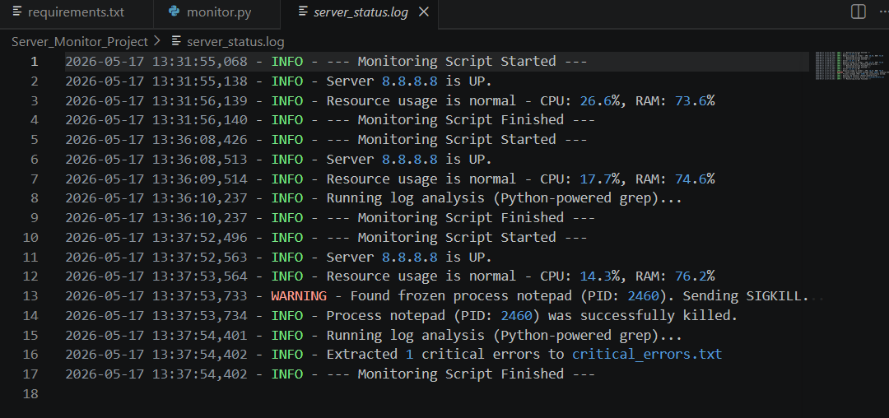
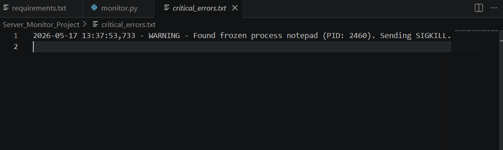

# 🖥️ Linux Server Monitor & Automation Script

A comprehensive automation and monitoring script designed as a practical hands-on project for **Module 3: Operating Systems** within the **Google IT Support Professional Certificate** course.

## 📝 Project Overview
This project acts as a production-ready automation tool for system administrators and DevOps engineers. It combines low-level operating system resource monitoring (CPU and RAM utilization), network reachability validation (Ping diagnostics), and automated process state management using native OS signals (`SIGKILL` / `kill -9`). Additionally, it features a built-in log parser mimicking the Linux `grep` utility to filter and isolate critical system anomalies.

## ✨ Core Features
1. **Cross-Platform Network Diagnostics (Ping):** Validates remote host uptime with dynamic, platform-specific argument injection (adapts between Windows `-n` and Linux `-c` flags silently).
2. **Resource Tracking:** Captures real-time metric percentages for both CPU and Virtual Memory (RAM) using the `psutil` library.
3. **Automated Incident Resolution (Process Killer):** Monitors running processes and instantly dispatches a `SIGKILL` (signal 9) to frozen or blacklisted targets (e.g., `notepad`) to prevent resource exhaustion.
4. **Log Filtering (Python-powered Grep):** Continuously monitors the health log, extracts the 10 most recent critical warnings (`WARNING`/`ERROR`), and compiles them into a dedicated alert file.

## 📊 Live Execution Preview

Below is the visual verification of the script successfully executing its monitoring cycles, running the custom grep parser, and delivering native OS signals to terminate frozen targets:

### 📜 Comprehensive Execution Stream (`server_status.log`)


### 🎯 Isolated Critical Alerts (`critical_errors.txt`)


## 🛠️ Installation & Usage Guide

### 1. Environment Set Up
Ensure the target OS dependencies are met. Navigate to the root directory containing your project and run:
```bash
py -m pip install -r requirements.txt

### 2. Execution
To observe the process management function in real-time, open a Notepad window (`notepad`) before executing the script, then type:
```bash
py monitor.py