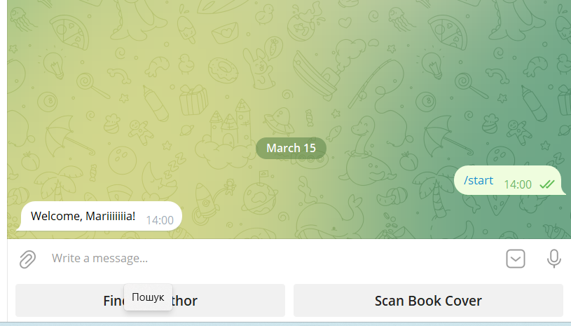
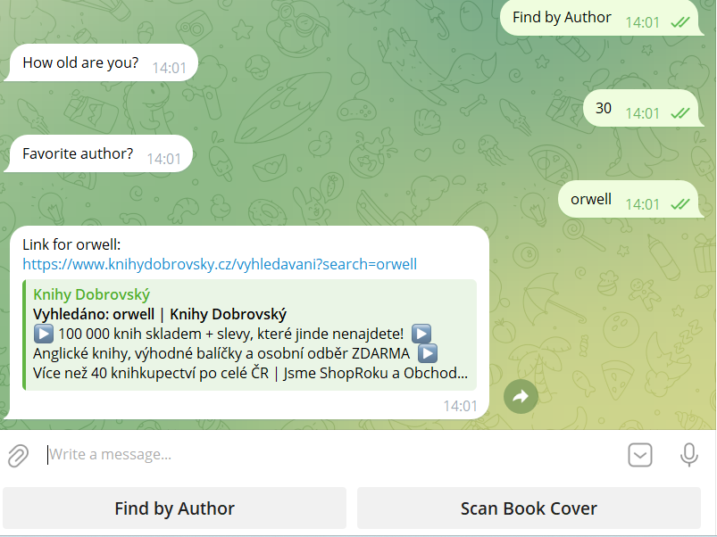

# AI-Powered Book Finder & Assistant Bot 📚🤖

An advanced Telegram bot that integrates **Optical Character Recognition (OCR)** for scanning covers and a **text-based search engine** to help users find books. The bot automatically generates direct search links to the bookstore and manages a customer database.

---

## 📺 Project Showcase
Experience the seamless integration of visual recognition and interactive search:

<p align="center">
  
  
  
</p>

*From left to right: 1. Custom UI with Reply Keyboards. 2. Interactive registration flow: collects user data and provides a direct search link for the favorite author. 3. Real-time book cover scanning with automatic search link generation.*

---

## 🌟 Key Features
* **AI Vision (OCR):** Powered by `Tesseract OCR` to extract text from images. Optimized for **English** and **Ukrainian** languages.
* **Smart Bookstore Integration:** Automatically generates search URLs for the `Knihy Dobrovský` store based on recognized book titles or authors.
* **Dual Search Mode:**
    * **Visual:** Scan any book cover to find it online instantly.
    * **Interactive:** Enter an author's name during registration to get a full list of their books.
* **Customer CRM Logic:**
    * Collects user profiles (ID, Name, Age, Favorite Author).
    * Logs data to `bookstore_customers.txt` for backend processing.
* **Advanced Conversation Flow:** Uses `Next Step Handlers` to create a smooth, non-blocking registration experience.
* **High Performance:** Utilizes `io.BytesIO` for processing image streams in memory without saving temporary files.

---

## 🛠 Tech Stack
* **Language:** Python 3.14 (Latest)
* **Bot Framework:** `pyTelegramBotAPI` (telebot)
* **OCR Engine:** `PyTesseract`
* **Image Processing:** `Pillow` (PIL)

---

## 🚀 Setup & Installation

### 1. Prerequisites
* Install the **Tesseract OCR** engine ([Official Download Link](https://github.com/UB-Mannheim/tesseract/wiki)).
* Update the path in your code to point to your `tesseract.exe`:
  ```python
  pytesseract.pytesseract.tesseract_cmd = r'C:\Program Files\Tesseract-OCR\tesseract.exe'
  ```

### 2. Installation
Install all required Python libraries with one command:
```bash
pip install pyTelegramBotAPI pytesseract Pillow
```

### 3. Running the Bot
1. Get your API token from [@BotFather](https://t.me/botfather).
2. Replace the token placeholder in your Python script.
3. Start the script:
```bash
python main.py
```

---

## 📋 Available Commands
* **Find by Author** — Starts an interactive form to gather user preferences and provide a direct search link to all books by that author.
* **Scan Book Cover** — Scans an uploaded photo to identify the book and find it in the online store.

---
*Developed as part of an advanced Python automation and AI integration study.*