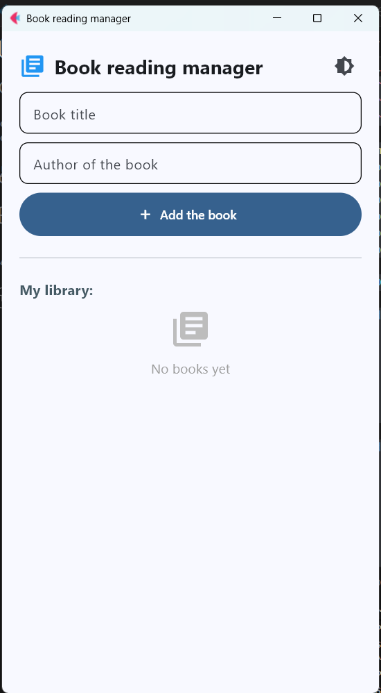
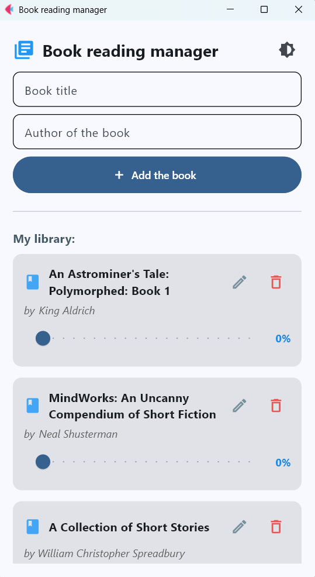
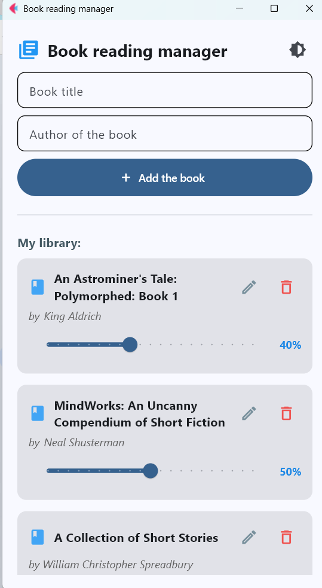
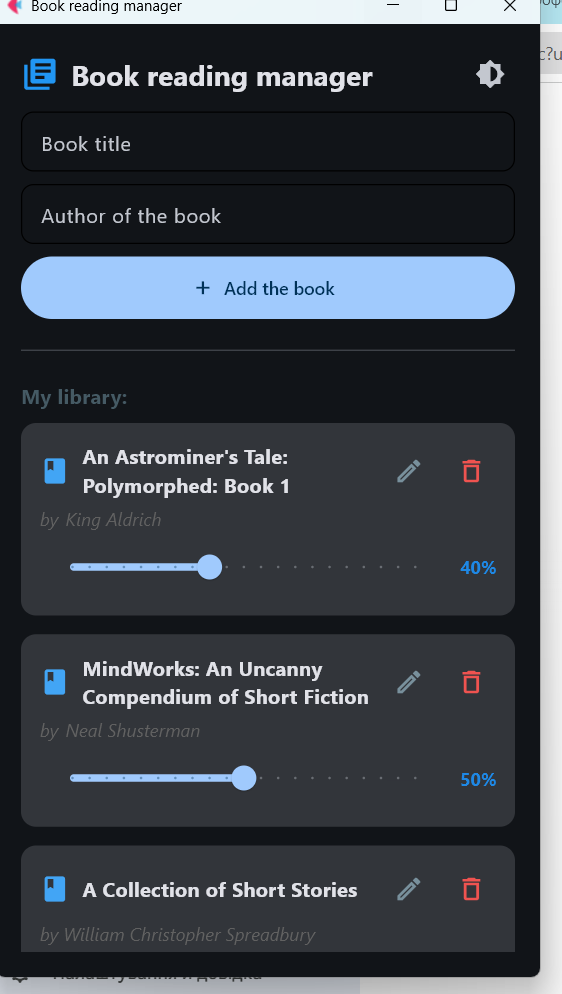

# Book Reading Manager

A sophisticated personal library tracker built with the **Flet** framework. This application allows users to curate their digital library, track reading progress in real-time, and manage book details with a modern, interactive interface.

## 📌 Key Features
* **Interactive Progress Tracking**: Update your reading status using a visual slider with real-time percentage feedback.
* **In-Place Editing**: Modify book titles and authors directly within the library cards using a toggleable edit mode.
* **Persistent Local Storage**: All library data is automatically saved to and loaded from a `books_data.json` file.
* **Theme Flexibility**: Switch between **Light and Dark modes** with a single click to suit your environment.
* **Dynamic UI States**: Features a custom "Empty State" view with clear icons when no books are present in the library.
* **Input Validation**: Robust checks for empty fields with visual error messages to ensure data integrity.

## 🛠 Tech Stack
* **Python 3**
* **Flet** — For the reactive, Material Design 3 user interface.
* **JSON** — For lightweight and reliable local data persistence.

## 📸 Visual Overview
Explore the application interface using the latest screenshots:

| Empty Library | Active Library | Progress Tracking | Dark Mode |
| :---: | :---: | :---: | :---: |
|  |  |  |  |

