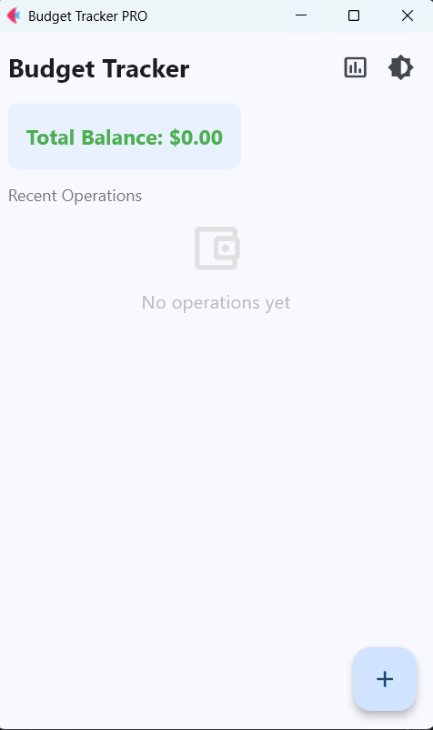
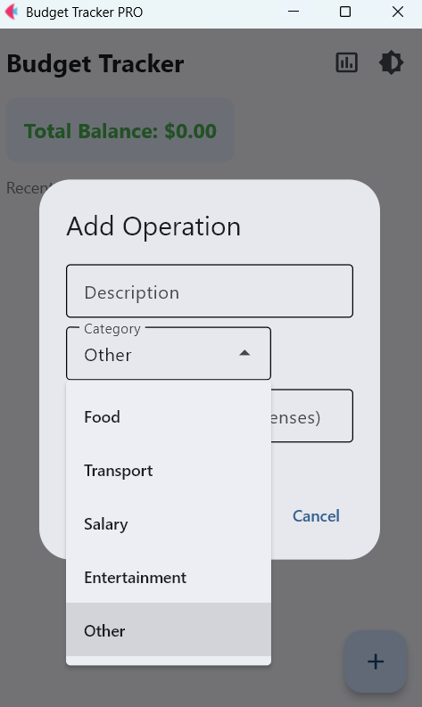
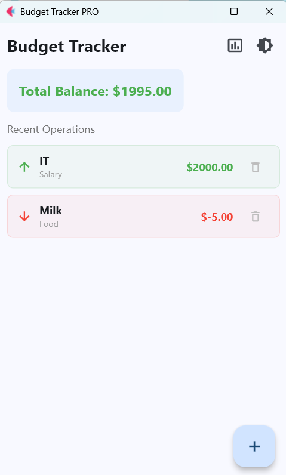
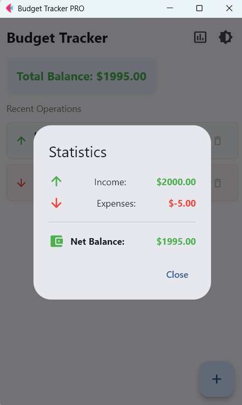
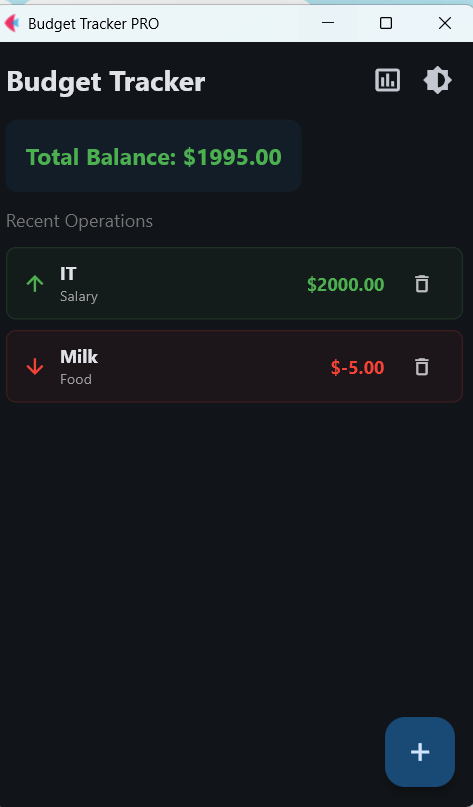

# Budget Tracker PRO

A comprehensive personal finance management tool built with the **Flet** framework. This application provides a modern interface to track income and expenses with local data persistence.

## 📌 Key Features
* **Full CRUD Functionality:** Add and delete financial operations with descriptions and categories.
* **Local Data Persistence:** All transactions are saved to a `data.json` file, ensuring your data is kept between sessions.
* **Financial Analytics:** Dedicated statistics modal to view total income, expenses, and net balance at a glance.
* **Theme Customization:** Seamlessly toggle between **Light and Dark modes** for comfortable use.
* **Dynamic UI:** Features a reactive balance display, category filtering (via Dropdown), and a clean Material Design layout.
* **Robust Validation:** Handles various number formats and prevents invalid data entry.

## 🛠 Tech Stack
* **Python 3**
* **Flet** — For building the reactive, cross-platform UI.
* **JSON** — For simple and effective local storage.

## 📸 Visual Overview
Explore the application interface:

| Main Dashboard | Adding Operations | Data Persistence |
| :---: | :---: | :---: |
|  |  |  |

| Analytics View | Dark Mode Support | Empty State |
| :---: | :---: | :---: |
|  |  |  |

## 🚀 How to Run
Ensure you have Python installed, then install Flet:
   ```bash
   pip install flet
   python main.py