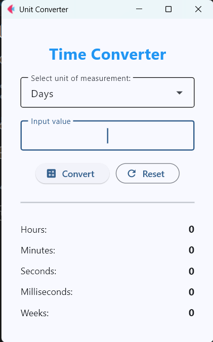
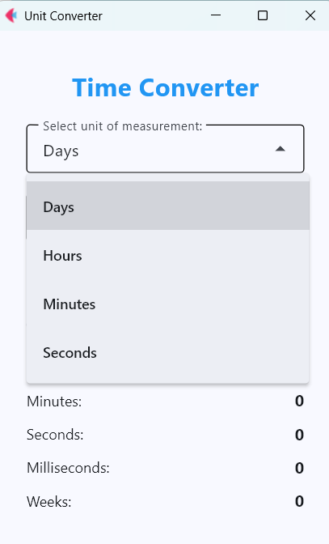
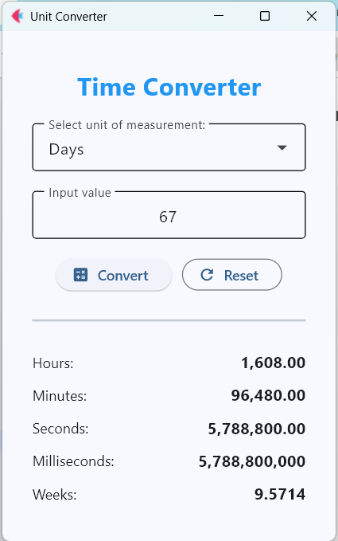

# Advanced Time Converter (Flet Version)

This is an upgraded version of the original Time Converter, rebuilt using the **Flet** framework. It features a modern Material Design interface, enhanced logic, and flexible unit selection.

## 📌 Features
* **Dynamic Unit Selection:** Use a Dropdown menu to select the input unit (Days, Hours, Minutes, or Seconds).
* **Comprehensive Calculations:** Instantly converts the input into 5 different time units simultaneously.
* **Modern UI:** Built with Material Design components, including structured rows, dividers, and custom icons.
* **Error Handling:** Includes robust validation to manage non-numerical inputs with user-friendly error messages.
* **Numerical Formatting:** Results are formatted with thousands separators and specific decimal precision for clarity.

## 🛠 Tech Stack
* **Python 3**
* **Flet** — A reactive UI framework for building modern applications.

## 📸 Visual Overview
The application workflow is shown below:

| 1. App Startup | 2. Unit Selection | 3. Result View |
| :---: | :---: | :---: |
|  |  |  |

## 🚀 How to Run
1. Ensure you have Python installed, then install the Flet library and run the app:
   ```bash
   pip install flet && python main.py