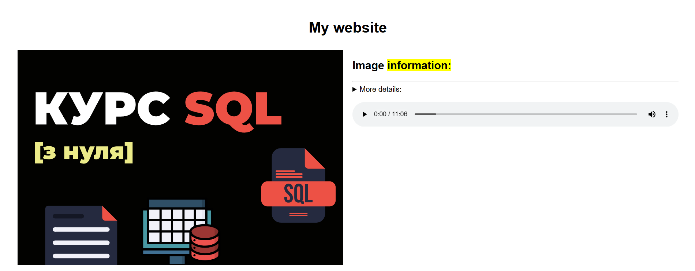
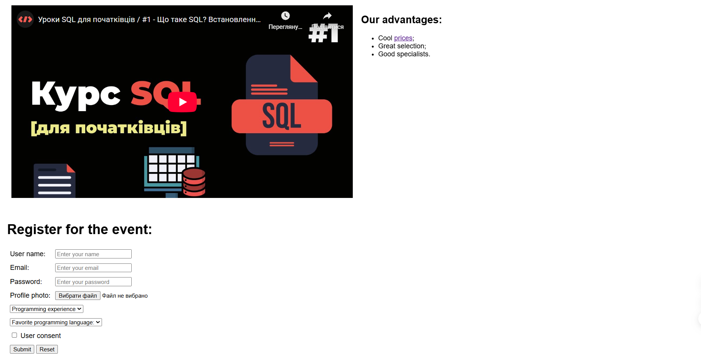

# Static HTML Website Demo 🌐

A fundamental web project showcasing standard HTML capabilities without external CSS. This landing page demonstrates structured content layout, multimedia integration, and a complete registration form.

##  Key Features
* **Media Handling:** Embeds vector graphics (SVG), standard images, local audio controls, and an external YouTube `iframe`.
* **Interactive Content:** Utilizes the semantic `
` and `
` tags for expanding content.
* **Comprehensive Registration Form:** Features text inputs, email/password masking, file uploads, dropdown selects, and dynamic lists.
* **Legacy Layout Foundation:** Structured entirely using HTML tables with inline styling for element alignment and spacing.

## 🛠 Tech Stack
* **HTML5:** Structural elements and media tags.
* **HTML Attributes:** Layout management and element positioning using pure HTML attributes (table-based design).

## 📸 Preview

  

  

##  Note on Style & Validation
This project intentionally uses table-based layout and inline styling to demonstrate a deep understanding of core HTML attributes. While modern web standards favor external CSS, this repository serves as a functional study of HTML's built-in structural and legacy layout capabilities.

##  How to View
1. Clone the repository.
2. Open `index.html` in any modern web browser.

---
*Developed as part of a Web Development fundamentals study.*