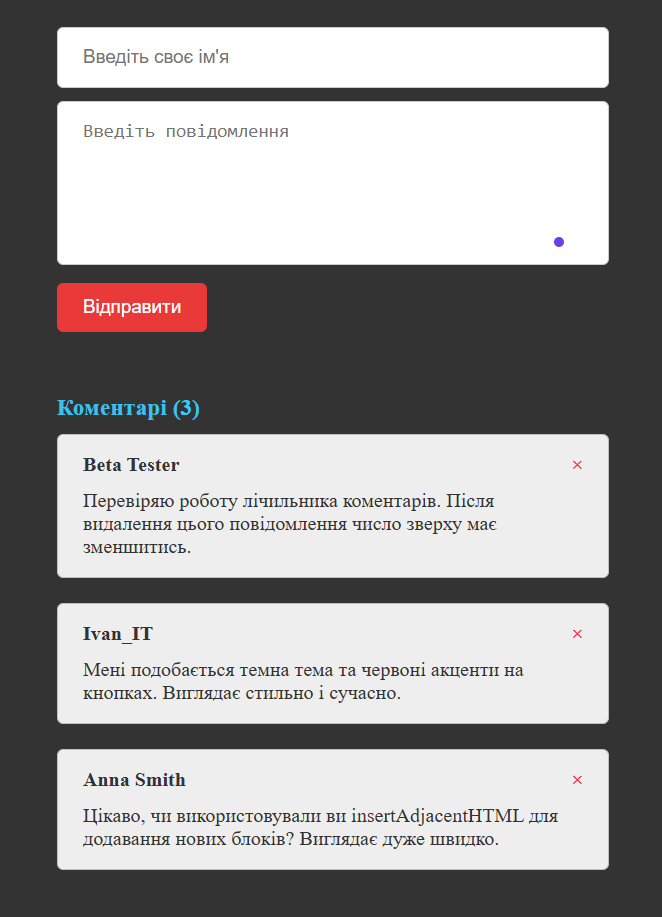

# Dynamic Comment System

A lightweight, interactive comment board built with vanilla JavaScript, HTML5, and CSS3. This project demonstrates real-time DOM manipulation and client-side form validation.

## 📸 Preview

> **🔗 Live Demo:** [View Project Online](https://mariatupik.github.io/My-Python-Journey/ItProger/JS-Dynamic-Comments-System/)

---

## 🚀 Features
- **Real-time Validation**: Robust checks for username length (min 2 chars) and message content (min 10 chars) with instant error feedback.
- **Dynamic CRUD (Create/Delete)**: Seamlessly add new comments to the top of the feed and remove them with a single click.
- **Live State Tracking**: An automated counter that updates in real-time as comments are added or deleted.
- **Smart UI Placeholders**: Dynamic "No comments yet" message that toggles automatically based on the list's state.
- **Responsive Dark Theme**: Modern UI design with smooth CSS transitions and a focus on readability.

## 🛠 Technologies Used
- **JavaScript (ES6)**: Logic, event handling, and DOM manipulation.
- **HTML5**: Semantic structure and forms.
- **CSS3**: Dark theme UI, flexbox, and smooth transitions.

## 🔧 Technical Highlights
- Uses `insertAdjacentHTML` for efficient DOM updates.
- Implements `onclick` event handlers for both form submission and dynamic deletion.
- Features a responsive design for the comment form and display area.

## 📂 How to Use
1. Clone the repository.
2. Open `index.html` in any modern web browser.
3. Enter your name and a message to see the system in action!