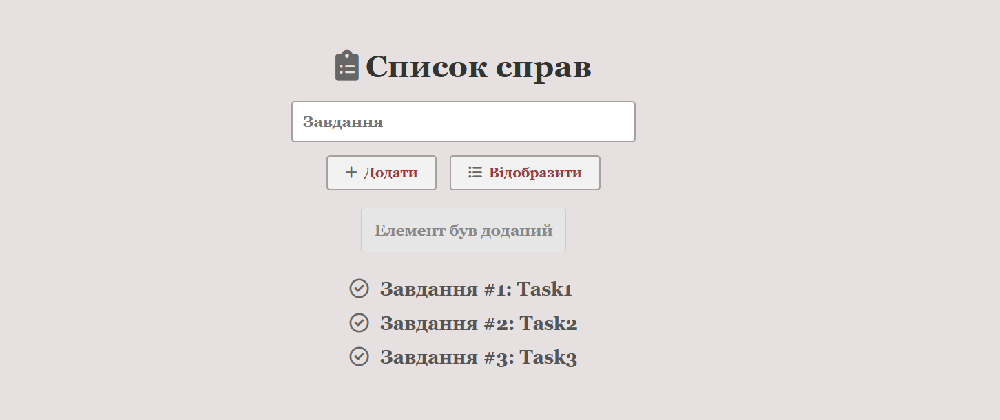

# 📋 JS-jQuery-Task-Tracker

A clean, minimalist task management application built with **jQuery**. This project focuses on DOM manipulation, event handling, and dynamic UI updates with smooth animations.

## 🚀 Live Demo
**[View Project Live](https://mariatupik.github.io/My-Python-Journey/ItProger/JS-jQuery-Task-Tracker/)**

---

## 📸 Project Preview

---

## 🛠 Key Features & Functionality
* **Dynamic List Management:** Add tasks to an internal array and render them on demand.
* **Smart Input Handling:** Uses state management to clear inputs and store data efficiently.
* **Animated Notifications:** Integrated a "toast" notification system using `.fadeIn()`, `.delay()`, and `.fadeOut()` for better UX.
* **Robust UI logic:** Implemented `.stop(true, true)` to prevent animation queuing during rapid interactions.
* **Looping & Indexing:** Utilizes `$.each` for precise task numbering and dynamic HTML injection.
* **Responsive Design:** Styled with a professional "Georgia" serif aesthetic and Font Awesome 6 integration.

---

## 💻 Tech Stack
* **Core:** HTML5, CSS3 (Flexbox for centering and layout).
* **Logic:** JavaScript (ES6) + **jQuery 3.7.1**.
* **Icons:** [Font Awesome 6](https://fontawesome.com/).
* **Typography:** System Web-Safe Fonts (Georgia, Serif).

## 📐 Implementation Details
In this project, I practiced the "State-to-UI" pattern where data is first pushed to a JavaScript array (`tasksArray`) and only rendered to the DOM when the user explicitly triggers the display. This approach keeps the Document Object Model clean and predictable.

---

## 📂 How to Use

1. Clone the repository.
2. Open `index.html` in any modern web browser.
3. Enter your task and click **"Додати"**, then click **"Відобразити"** to see the system in action!