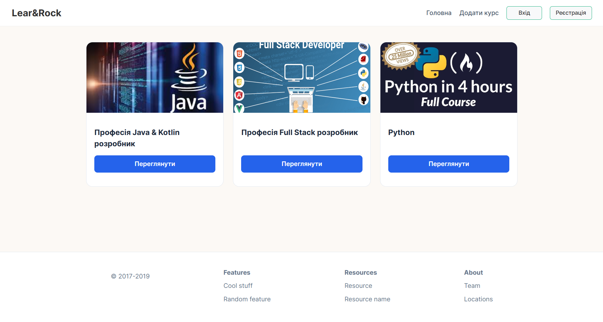
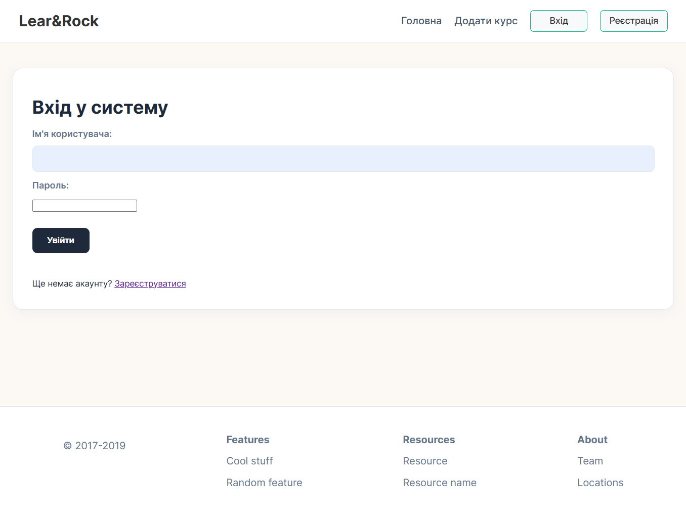
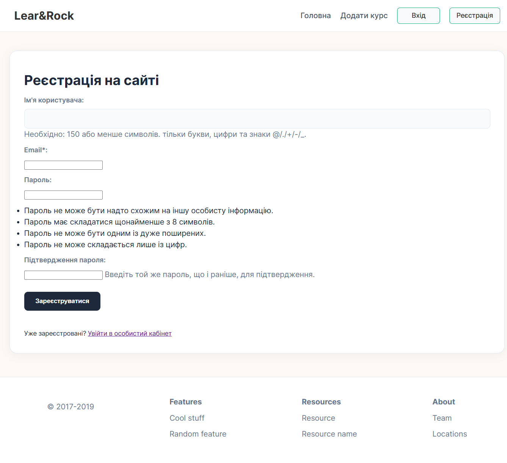
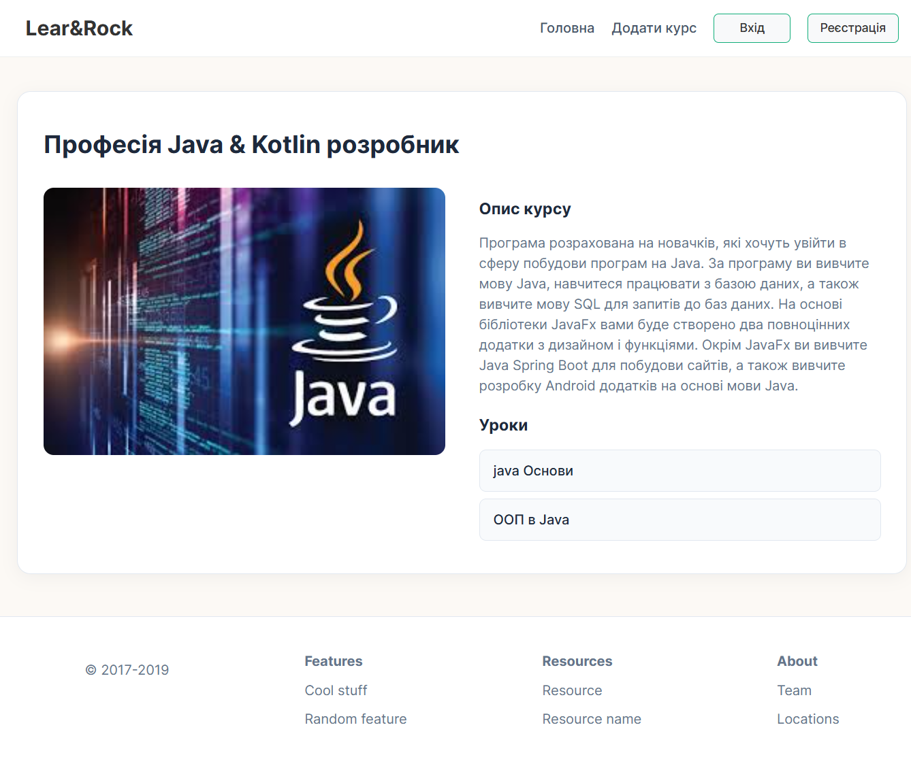
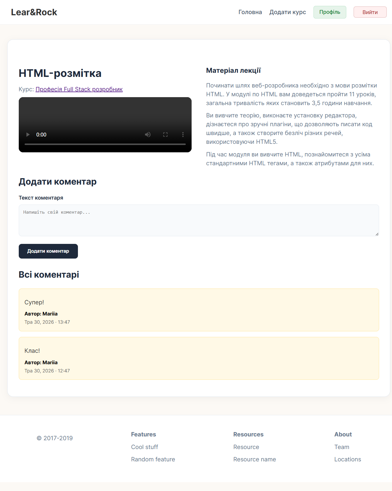
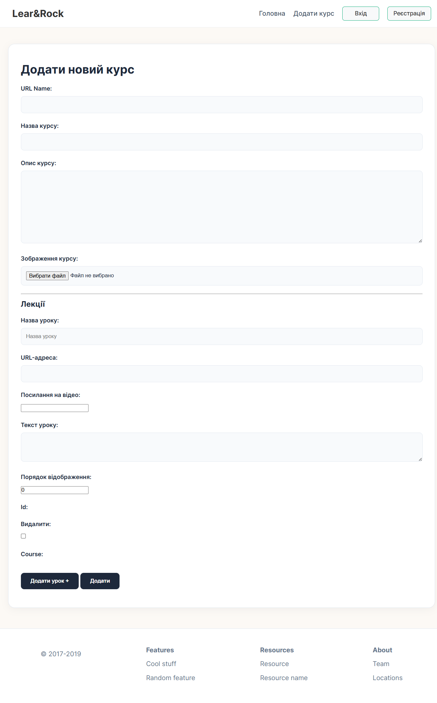

# 🚀 Lear&Rock E-Learning Platform

A functional web application built with **Django**, focusing on clean URL routing, template inheritance, and professional project structure. This project demonstrates the core capabilities of the Django framework in handling dynamic educational web content, custom model form validation, and relational databases.

---

## 📸 Project Preview

### Home Page (`/`)


### Authentication Pages
| Page | Preview |
| :--- | :--- |
| **Login Page** |  |
| **Registration Page** |  |

### Course and Lesson Views
| View | Preview |
| :--- | :--- |
| **Course Details** |  |
| **Lesson & Discussion** |  |

### Content Management
| Feature | Preview |
| :--- | :--- |
| **Add Course Form** |  |

---

## 🎯 Project Objectives & Tasks
* **App Architecture:** Created a modular application structure handling Courses, Lessons, Comments, and User profiles.
* **URL Routing:** Configured precise and human-readable paths (Slugs) for seamless navigation across courses and specific lessons.
* **Template Engine:** Implemented advanced HTML inheritance using a base layout and blocks to ensure DRY (Don't Repeat Yourself) code.
* **Database & Admin:** Designed relational database tables using custom model definitions and set up the Django administrative interface.
* **Dynamic Course Processing:** Created a customized frontend submission system where users can publish new courses alongside multiple dynamic lesson blocks in a single process.
* **User Authentication Subsystem:** Implemented functional registration, login, and secure session state control with proper route access restrictions.
* **Interactive Discussion Loop:** Integrated a standard Django-driven comment system that aggregates, processes, and displays chronological feedback under individual lectures.

---

## ✨ Key Features
* **Dynamic Routing with Slugs:** Seamless navigation between main sections of the site using strict structural slugs like `/course/<slug:slug>/lesson/<slug:lesson_slug>/`.
* **Atomic Inline FormSets:** Leverages Django's `inlineformset_factory` to safely process and create a `Course` instance and all corresponding nested `Lesson` instances simultaneously via one atomic POST request.
* **Strict Unique Validation:** Custom uniqueness constraints on database layer (`unique_together` for course-specific lesson slugs and `unique=True` for course slugs) preventing broken routes.
* **Dynamic Field Modifiers:** Overridden form initialization blocks to dynamically enforce strict field validation requirements across all dynamic input layers.
* **Secure ModelForm Component Shading:** Hidden security configuration widgets (`forms.HiddenInput()`) for foreign fields like `user` and `lesson`, preventing cross-site user tampering.
* **Post Data Mutability Handling:** Leverages explicit `.copy()` mutations inside Class-Based Views (`LessonDetailPage`) to automatically map authentic request session signatures (`request.user.pk`) directly into form contexts before submission.
* **Optional Media Assets Handling:** Configured `blank=True, null=True` for cover uploads (`ImageField`), allowing smooth form processing whether a banner image is uploaded or omitted.
* **User Profile & Registration Management:** Customized account creation via extended `UserCreationForm` with strict email requirements, accompanied by live profile updating capabilities (`UserUpdateForm`) linked directly to the session backend.
* **Session Flash Alerts:** Successful user lifecycle events trigger crisp, user-friendly success feedback notifications across views.

---

## 🧰 Tech Stack
* **Backend:** Python 3.x, Django 5.x
* **Frontend:** HTML5, CSS3, Bootstrap (Form Controls)
* **Database:** SQLite (Development)
* **Environment:** Virtualenv (venv)

---

## 🚀 How to Run

1. **Clone the repository:**
   ```bash
   git clone <your-repository-url>
   ```

2. **Set up Virtual Environment:**
   ```bash
   python -m venv venv
   # On Windows:
   .\venv\Scripts\activate
   # On macOS/Linux:
   source venv/bin/activate
   ```

3. **Install Dependencies:**
   ```bash
   pip install django pillow
   ```

4. **Apply Database Migrations:**
   ```bash
   python manage.py makemigrations
   python manage.py migrate
   ```

5. **Create an Admin Account (Optional):**
   ```bash
   python manage.py createsuperuser
   ```

6. **Start the Development Server:**
   ```bash
   python manage.py runserver
   ```

7. **Access the App:**
   Open `http://127.0.0.1:8000/` in your browser.