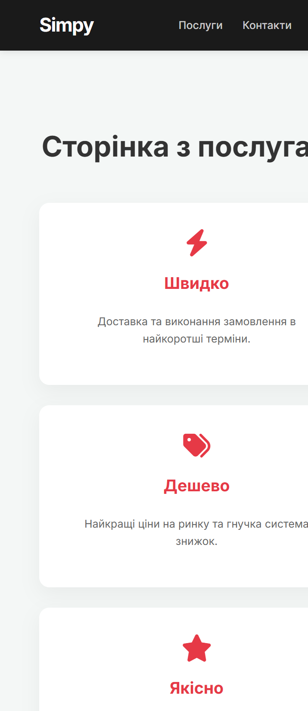

# 🚀 Simpy Django Services

A functional web application built with **Django**, focusing on clean URL routing, template inheritance, and professional project structure. This project demonstrates the core capabilities of the Django framework in handling dynamic web content and managing assets professionally.

---

## 📸 Project Preview

### Home Page (`/`)


### Services Page (`/uslugi/`)


---

## 🎯 Project Objectives & Tasks
* **App Architecture:** Created a modular application structure with a dedicated `main` app.
* **URL Routing:** Configured precise paths for Home (`/`) and Services (`/uslugi/`) pages.
* **Template Engine:** Implemented advanced HTML inheritance using a base `layout.html` and blocks to ensure DRY (Don't Repeat Yourself) code.
* **Static Management:** Integrated professional CSS styling and assets through Django's static file system.
* **Database & Admin:** Successfully performed migrations and set up the Django administrative interface for backend management.

## ✨ Key Features
* **Dynamic Routing:** Seamless navigation between main sections of the site.
* **Modular Design:** Clear separation between business logic (`views.py`) and presentation (`templates`).
* **Responsive Layout:** A modern, mobile-friendly design for service presentation with clean UI cards.
* **Admin Ready:** Includes a pre-configured backend for content management at `/admin/`.

## 🧰 Tech Stack
* **Backend:** Python 3.x, Django 5.x
* **Frontend:** HTML5, CSS3 (Custom Styling)
* **Database:** SQLite (Development)
* **Environment:** Virtualenv (venv)

---

## 🚀 How to Run

1. **Clone the repository:**
   ```bash
   git clone 
   ```

2. **Set up Virtual Environment:**
   ```bash
   python -m venv venv
   # On Windows:
   .\venv\Scripts\activate
   # On macOS/Linux:
   source venv/bin/activate
   ```

3. **Install Dependencies:**
   ```bash
   pip install django

4. **Apply Database Migrations:**
   ```bash
   python manage.py migrate
   ```

5. **Create an Admin Account (Optional):**
   ```bash
   python manage.py createsuperuser
   ```

6. **Start the Development Server:**
   ```bash
   python manage.py runserver
   ```

7. **Access the App:**
   Open `http://127.0.0.1:8000/` in your browser.

---
*Developed as part of the Django Web Development Track.*