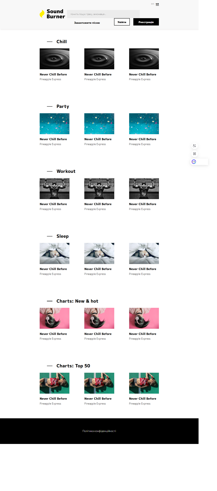

# SoundBurner – Music Portal Concept 🎵

**Brief:** A high-fidelity music portal landing page implemented from a professional Figma design. This project focuses on clean CSS architecture, logical element positioning, and asset management.

## 🌟 Key Features
* **Design-to-Code Implementation:** Focused on high accuracy in translating the `Sound Burner.fig` mockup into a functional web interface.
* **Component-Based Layout:** Organized sections for different music categories (Chill, Party, Workout, Sleep) and global charts.
* **Interactive UI Elements:**
    * Custom-styled search bar and navigation system.
    * Dynamic hover states on track cards featuring absolute-positioned play button overlays.
    * Language switcher with active state indicators.
* **Modern Typography:** Integrated "M PLUS 1p" via Google Fonts for a sleek, contemporary aesthetic.

## 🛠 Tech Stack
* **HTML5:** Semantic markup for structured content.
* **CSS3:** Custom styling using absolute positioning, box-shadows, and hover transitions (no external frameworks).
* **Font Awesome:** Integrated via CDN for professional UI icons.

## 🎨 Design Source
The original design asset used for this project is included in the repository:
* `Sound Burner.fig` — Source file for [Figma](https://www.figma.com/).

## 📸 Preview
<p align="center">
  
</p>

## 📂 Project Structure
```text
SoundBurner-Music-Portal/
├── index.html          # Main HTML entry point
├── Sound Burner.fig    # Original Figma design file
├── css/
│   └── main.css        # Custom stylesheets
└── img/                # Media assets and preview image
    ├── logo.png
    ├── preview.png
    └── sound-1...6.png
```

## 🚀 How to View
1. Clone or download the repository.
2. Open `index.html` in any modern web browser.

---
*Developed as part of a Web Development and UI/UX implementation study.*