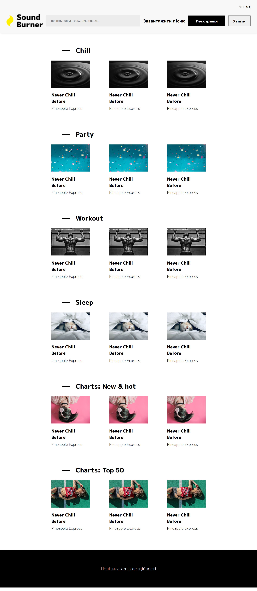

# SoundBurner v2 – Responsive Music Portal 🚀

**Brief:** An advanced evolution of the SoundBurner music portal. This version marks the transition from static layouts to **Responsive Web Design (RWD)**, utilizing Flexbox architecture and interactive CSS animations for a modern user experience.

## 🌟 Key Improvements in v2
* **Flexbox Layout:** Entirely rebuilt using `display: flex` for dynamic content alignment and professional spacing between track cards.
* **Full Responsiveness:** Implemented a multi-stage adaptive system using CSS **Media Queries** to support all devices:
    * **Desktop (1571px+):** Centered 60% width layout for ultra-wide screens.
    * **Laptops (1111px - 1570px):** Balanced 80% width layout.
    * **Tablets (921px - 1110px):** Maximum space utilization (95% width).
    * **Mobile (< 920px):** Smart stacking strategy — the header components and track cards switch to `flex-direction: column` for vertical scrolling.
* **UI Interactivity & Motion:**
    * Smooth CSS transitions (`0.6s ease`) on all links, buttons, and icons.
    * Animated "Play" button overlays that fade in on hover using absolute positioning.
    * Hover-sensitive language switcher with active state indicators.

## 🛠 Tech Stack
* **HTML5:** Semantic markup with optimized meta-tags.
* **CSS3 (Advanced):** * Flexbox (containers, alignment, wrap).
    * Media Queries (4 custom breakpoints).
    * Position Absolute/Relative for UI overlays.
    * Google Fonts ("M PLUS 1p") integration.

## 📸 Preview
<p align="center">
  
</p>

## 📂 Project Structure
```text
SoundBurner-Responsive-v2/
├── index.html          # Clean HTML5 structure
├── css/
│   └── main.css        # Stylesheet with Media Queries & Flexbox
└── img/                # UI assets (logo, track covers)