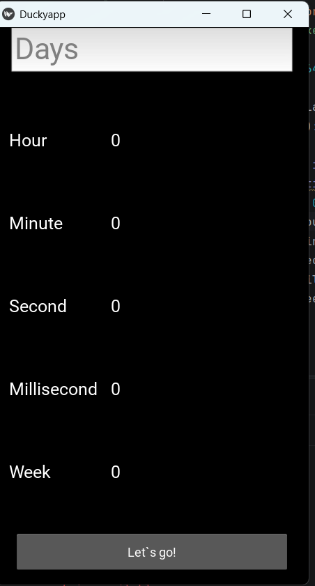
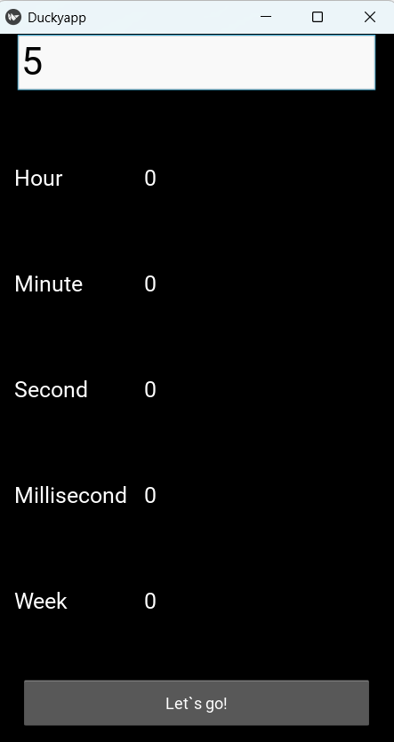
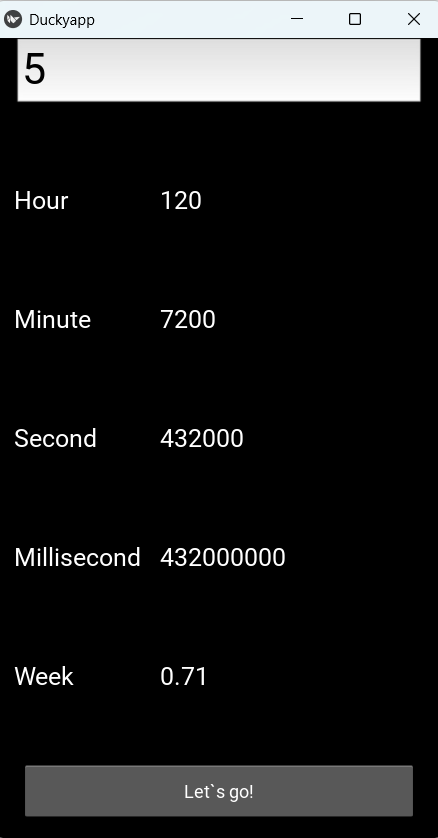

# Time Converter (Duckyapp)

A practical graphical user interface (GUI) application built with **Kivy**. This utility, named **Duckyapp**, specializes in converting a given number of days into multiple time units simultaneously.

##  Features
* **Multi-Unit Conversion:** Convert days into Hours, Minutes, Seconds, Milliseconds, and Weeks in a single click.
* **Interactive UI:** Clean, dark-themed interface with high-contrast text for better readability.
* **Real-time Feedback:** Instantly updates all time fields when the "Let's go!" button is pressed.
* **Input Validation:** Designed to handle numerical input to perform precise mathematical transformations.

##  Tech Stack
* **Python 3**
* **Kivy Framework** — Used for the cross-platform UI and event handling.

##  Visual Overview
The following screenshots demonstrate the Duckyapp workflow:

| 1. Initial State | 2. User Input | 3. Conversion Result |
| :---: | :---: | :---: |
|  |  |  |

##  How to Run
Ensure you have Python installed, then install Kivy and run the app:
   ```bash
   pip install kivy && python main.py
