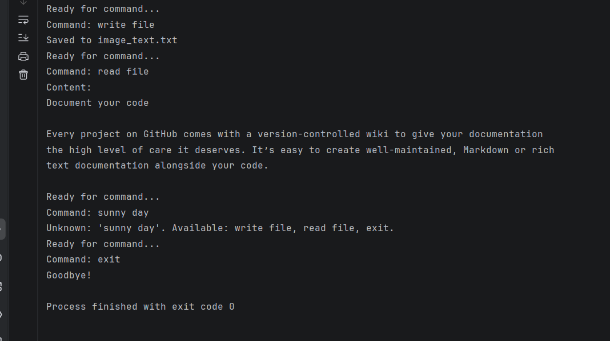

# Voice-Controlled OCR Assistant 🎙️📸

A smart automation tool that combines **Speech Recognition** and **Optical Character Recognition (OCR)**. This project demonstrates how to bridge the gap between audio input and text processing using Python.

##  Project in Action

*Example of the workflow: Detecting voice commands, extracting text from an image, and managing files.*

## Key Features
* **Voice Command Detection:** Uses `SpeechRecognition` with Google’s API to process verbal instructions.
* **OCR Integration:** Powered by `Tesseract OCR` to read text from local images (`photo.png`).
* **Automated File I/O:**
    * `write file`: Scans the image and exports text to `image_text.txt`.
    * `read file`: Reads and displays the content of the generated file.
* **Smart Audio Handling:** Automatically adjusts for ambient noise to improve recognition accuracy in different environments.

## 🛠 Tech Stack
* **Python 3.14** (or 3.x)
* **SpeechRecognition**: For capturing and converting speech.
* **PyTesseract**: Python wrapper for the Tesseract-OCR engine.
* **Pillow (PIL)**: For opening and pre-processing images.

## 🚀 Setup & Installation

### 1. Install Tesseract OCR
You must have the Tesseract engine installed on your OS.
* Download it from: [Tesseract OCR for Windows](https://github.com/UB-Mannheim/tesseract/wiki).
* In the code, update the path to your `.exe` file:
    ```python
    pytesseract.pytesseract.tesseract_cmd = r'C:\Program Files\Tesseract-OCR\tesseract.exe'
    ```

### 2. Install Python Libraries
Run the following command in your terminal:
```bash
pip install SpeechRecognition pytesseract Pillow