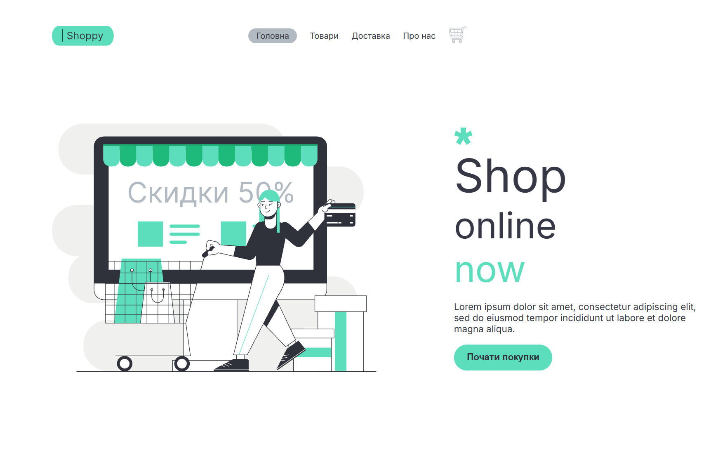
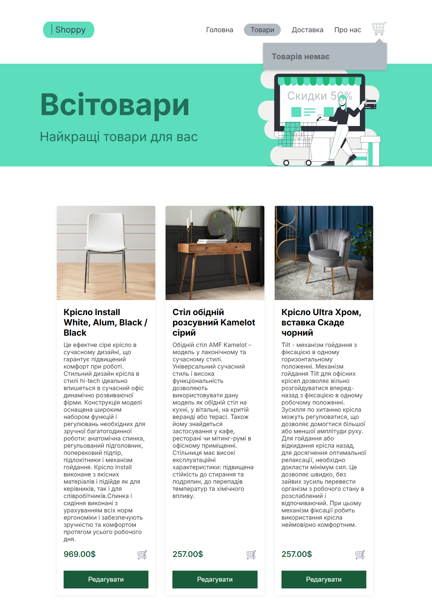
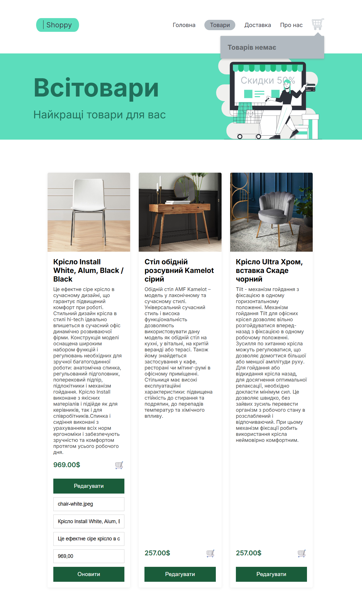
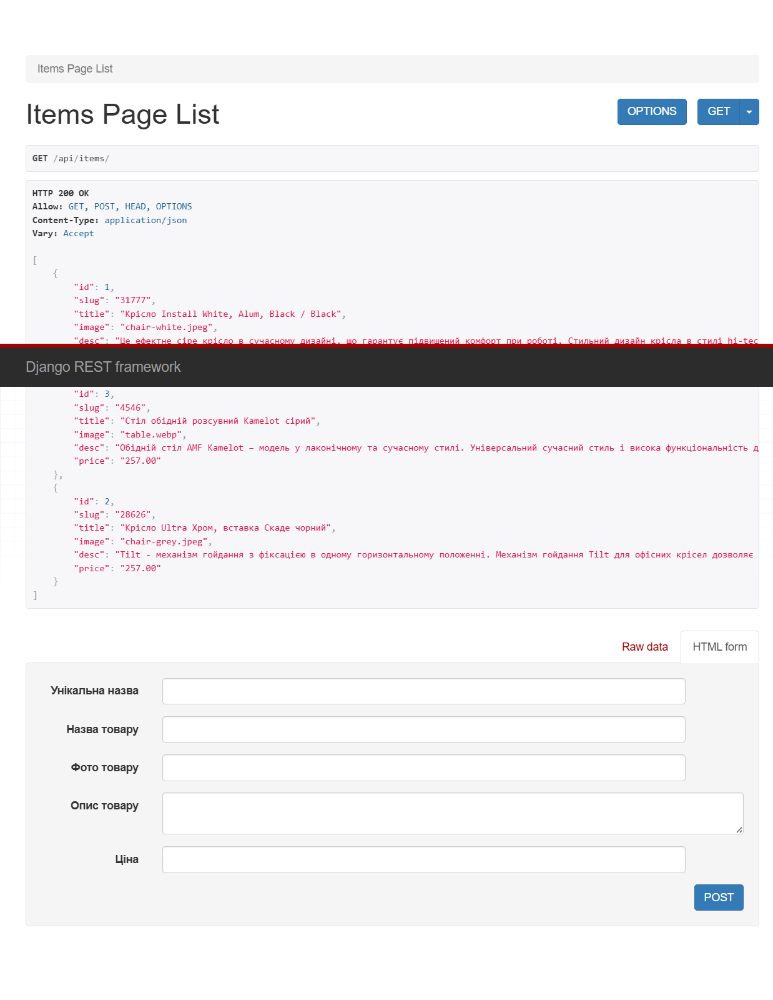

# Full-Stack E-Commerce Store (Furniture Shop)

A modern full-stack e-commerce web application featuring a dynamic user interface for browsing products and a fully integrated REST API backend for managing products, tracking orders, and handling secure online payments.

---

## 📸 Project Preview

Here is a visual demonstration of the fully functional e-commerce ecosystem, highlighting both the dynamic user interface and the backend data management capabilities:

### 🌐 Frontend User Interface (Vue 3 + Vite)

* **Main Page Preview:** Welcome landing screen with direct navigation options.


* **Interactive Product Catalog:** Dynamic grid loading furniture properties, prices, and imagery asynchronously from the Django backend.


* **Live CRUD Customization Forms:** Toggleable edit inputs inside specific element blocks to alter records directly via asynchronous API calls.


### ⚙️ Backend Data Management (Django REST Framework)

* Fully structured API endpoints combined with built-in HTML forms to insert fresh item payloads or evaluate incoming analytical fields directly inside the relational database logs.


> **💡 Asset Placement Tip:** To display these screenshots on your GitHub profile, create a folder structure like `public/img/` in your repository root, copy your images there, and rename them to match the filenames specified above.

---

## 🚀 Key Features

* **Dynamic Product Catalog:** Asynchronous data fetching to display available furniture with dynamic rendering on the client side.
* **Live Data Sync & CRUD Operations:** Full capability to edit product details (title, description, price, image) directly from the UI with instant updates.
* **Interactive Shopping Cart:** Real-time calculation of item quantities and total order sum managed natively on the frontend.
* **Fondy (Cloudipsp) Payment Gateway Integration:** Automatically generates secure payment links and handles transaction scaling (converting amounts to cents/kopecks) seamlessly upon checking out.
* **Structured Database Relationships:** Dedicated models for handling dynamic product attributes (via unique slug identifiers) and comprehensive client order forms.

---

## 🛠️ Tech Stack

### Frontend
* **Vue 3 (Composition & Options API)** – Reactive framework for single-page components.
* **Vue Router 4** – Client-side routing (`/`, `/items`, `/order`, `/about`, `/delivery`).
* **Axios** – Asynchronous HTTP client for communicating with backend endpoints.
* **Vite** – Next-generation, lightning-fast frontend tooling and bundle setup.

### Backend
* **Django 5.x** – Core pythonic web framework.
* **Django REST Framework (DRF)** – Toolkit used to build powerful Web APIs (`ModelViewSet`, `APIView`).
* **Cloudipsp (Fondy API)** – Integrated SDK for financial transaction operations.
* **SQLite** – Default lightweight relational storage for development logs.

---

## 🗺️ System Architecture & API Endpoints

The system operates using a decoupled architecture, executing requests asynchronously between the client (port `5173`) and the server (port `8000`).

### Available Endpoints

| HTTP Method | Endpoint | Handler | Description |
| :--- | :--- | :--- | :--- |
| **GET** | `/api/items/` | `ItemsPage (ModelViewSet)` | Retrieves a complete list of furniture items in JSON format. |
| **POST** | `/api/items/` | `ItemsPage (ModelViewSet)` | Admin endpoint used to publish new items into the database. |
| **PUT** | `/api/edit-item/<slug>` | `ItemEdit (APIView)` | Updates existing fields of a specific item based on its unique slug. |
| **POST** | `/api/order-add/` | `OrderAdd (APIView)` | Validates the customer order data and returns a Cloudipsp checkout URL. |

---

## 📦 Database Schema

### `Item` Model
* `slug` (`SlugField`) – Unique alphanumeric text identifier for clean SEO routing.
* `title` (`CharField`) – Name of the furniture piece (max 200 chars).
* `image` (`CharField`) – Reference/Path string to the stored asset picture file.
* `desc` (`TextField`) – Full structural and raw design text descriptions.
* `price` (`DecimalField`) – Monetary value handling up to 5 digits with 2 decimal accuracy points.

### `Order` Model
* `name` & `surname` (`CharField`) – Primary customer tracking entries.
* `email` & `phone` (`CharField`) – Contact and dynamic verification properties.
* `basket` (`TextField`) – Serialized dynamic JSON string carrying all bought items data.

---

## ⚡ Setup and Installation

Follow these unified steps to clone, configure, and launch both the backend and frontend components of the application.

```bash
# 1. Clone the repository and navigate to the project directory
git clone [https://github.com/mariatupik/My-Python-Journey/tree/main/ItProger/Vue-Django-Furnitureshop](https://github.com/mariatupik/My-Python-Journey/tree/main/ItProger/Vue-Django-Furnitureshop)
cd Lesson-6

# ==========================================
# 2. BACKEND CONFIGURATION (Django)
# ==========================================

# Activate your python virtual environment (Windows example)
.\venv\Scripts\activate

# Install required backend python dependencies
pip install django djangorestframework django-cors-headers cloudipsp

# Run database migrations and start the Django server
python manage.py migrate
python manage.py runserver

# Backend server will now be running natively on: [http://127.0.0.1:8000/](http://127.0.0.1:8000/)

# ==========================================
# 3. FRONTEND CONFIGURATION (Vue 3 / Vite)
# ==========================================
# IMPORTANT: Open a separate terminal window and stay in the Lesson-6 folder

# Navigate directly into the folder where index.html and package.json reside
cd public

# Install all necessary npm node modules
npm install

# Launch the hot-reloading Vite development server
npx vite

# Frontend user interface will now be accessible on: http://localhost:5173/