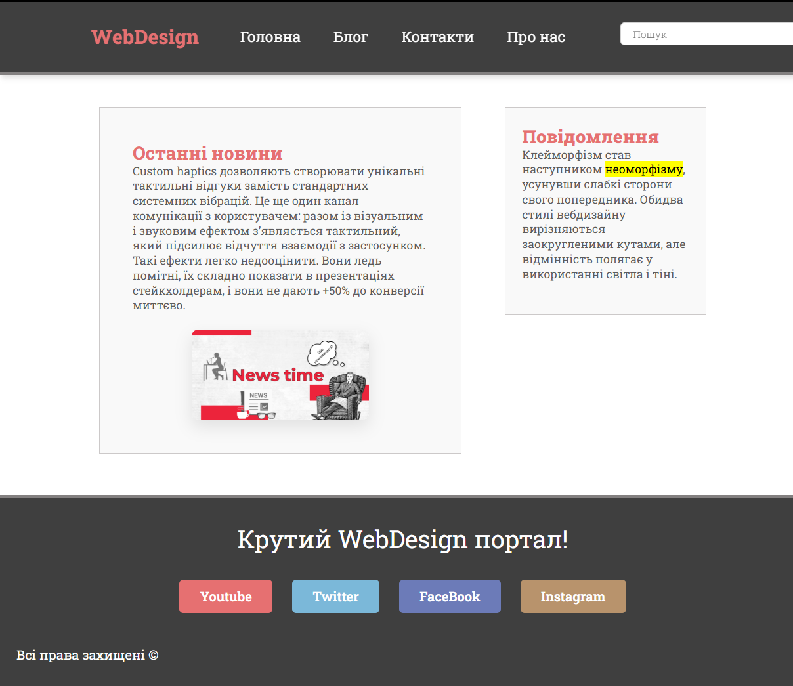

# WebDesign Static Portal 🌐

**Brief:** A static web portal project focused on mastering fundamental HTML5 structure and CSS3 styling techniques. This project emphasizes layout management using legacy and modern CSS properties without external frameworks or responsive design tools.

## 🌟 Key Features
* **Fixed Header Navigation:** Implemented using `position: fixed` to ensure the navigation bar remains accessible during scrolling.
* **Layout Management:** Utilizes `float` and `display: inline-block` for horizontal alignment of content sections.
* **Custom Typography:** Integration of "Roboto Slab" via Google Fonts for a consistent visual identity.
* **Visual Effects:** Strategic use of `box-shadow`, `border-radius`, and `transition` for interactive elements (buttons and images).
* **Social Media Section:** A styled footer with brand-specific color coding for various social platforms.

## 🛠 Tech Stack
* **HTML5:** Semantic markup for headings, navigation, and content sections.
* **CSS3:** Custom styling focusing on the box model, positioning, and typography management.

## 📸 Preview

  

## 🚀 How to View
1. Clone the repository.
2. Open `index.html` in any modern web browser.

---
*Developed as a study in core web styling and structural layout.*