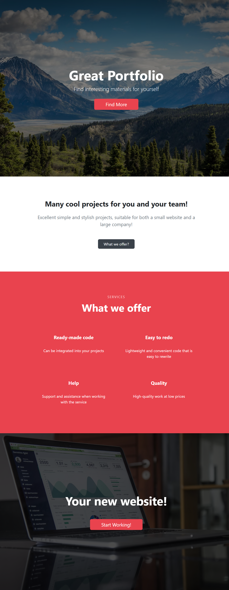

# Modern Bootstrap Portfolio Landing Page

A professional, responsive landing page built with HTML5, CSS3, and Bootstrap 5. This project features a clean corporate aesthetic with dynamic visual effects.

## 🚀 Key Features
- **Bootstrap 5 Framework**: Utilized for a fully responsive grid system.
- **Parallax Backgrounds**: Implemented fixed-attachment background images for Hero and Footer sections.
- **Service Cards**: A clean layout for service offerings with custom hover effects.
- **Custom Branding**: Overridden default Bootstrap styles with a custom color palette (#e9434e).

## 🛠 Technologies Used
- HTML5 & CSS3
- Bootstrap 5
- Google Fonts (Segoe UI)

## 📂 Installation
1. Clone the repository.
2. Open `index.html` in your browser.